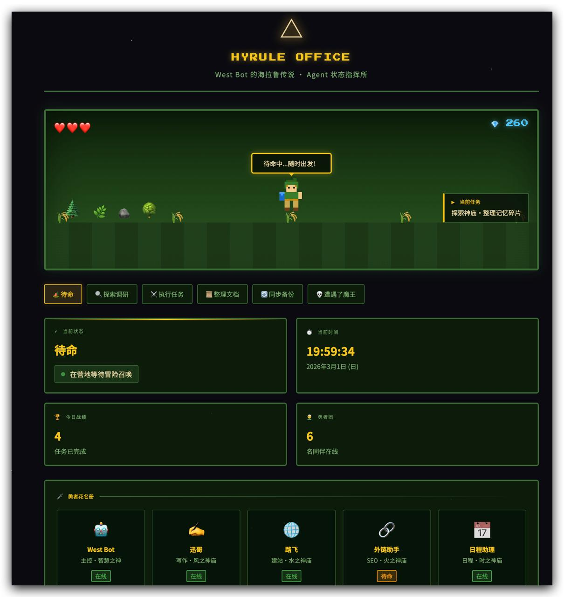

# Hyrule Office 🗡️

> West Bot 的海拉鲁传说 · Agent 状态指挥所

A Zelda-pixel-themed dashboard for tracking your AI agent fleet. Pure HTML/CSS/JS — no framework, no build step, zero dependencies.



## ✨ Features

- 🎮 **Pixel-art game scene** — your hero patrols the world, speech bubbles update with status
- ⚔️ **Status tabs** — Idle / Exploring / Executing / Docs / Syncing / Boss Fight
- 🕐 **Live clock** — real-time display with Japanese date format
- 👥 **Hero roster** — your agent fleet with online/idle/offline badges
- 💎 **Gem counter** — purely cosmetic, purely fun
- 🌑 **Dark terminal aesthetic** — green-on-black with gold accents

## 🚀 Usage

No build needed. Just open `index.html` in a browser — or serve with any static host.

```bash
# Local preview (Python)
python3 -m http.server 8080

# Or with npx
npx serve .
```

## 🛠️ Customization

Everything is in the `CONFIG` object at the top of `app.js`:

```js
const CONFIG = {
  diamonds: 260,    // cosmetic gem count
  tasksDone: 4,     // today's completed tasks

  statuses: { ... },  // status labels, descriptions, speech bubbles

  heroes: [
    { avatar: '🤖', name: 'West Bot', role: '主控・智慧之神', status: 'online' },
    // add your own agents here
  ],
};
```

### Status types
| Key | Scene |
|---|---|
| `idle` | 待命 — waiting at camp |
| `exploring` | 探索调研 — scouting the dungeon |
| `executing` | 执行任务 — charging the boss |
| `docs` | 整理文档 — filing the loot |
| `sync` | 同步备份 — uploading to the crystal |
| `boss` | 遭遇了魔王 — HELP |

### Hero badge status
- `online` — green, active
- `idle` — orange, standby
- `offline` — grey, unreachable

## 🌐 Deploy

Works on any static host:

- **GitHub Pages** — push to `gh-pages` branch or enable Pages in repo settings
- **Vercel / Netlify** — drag & drop the folder
- **Cloudflare Pages** — connect the repo

## 📁 File structure

```
hyrule-office/
├── index.html     # markup
├── style.css      # pixel-dark theme
├── app.js         # config + interactivity
├── screenshot.jpg # preview image
└── README.md
```

## License

MIT — fork it, skin it, make it yours.

---

*Built with ❤️ and way too much Zelda lore.*
